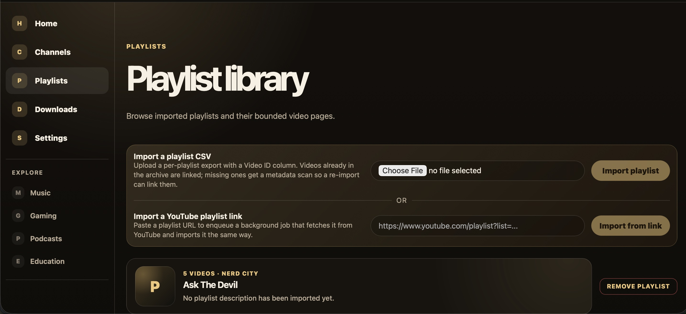

# Yummle

Yummle is a fork of Kapsel with a few extra features. Kapsel is a small self-hosted video archive for one person or household. It downloads online videos with `yt-dlp`, stores metadata in SQLite, keeps media on the filesystem, and serves a local web UI for browsing, searching, and watching your archive.



## Features

- Save individual videos and channel videos into a local archive.
- Watch downloaded media in the browser with seeking, captions, and preview thumbnails when available.
- Browse videos, channels, playlists, watched state, and playback progress.
- Search local metadata with SQLite FTS, including imported titles, descriptions, subtitles, and comments.
- Import core TubeArchivist backup data.
- Back up and restore SQLite metadata separately from large media files.
- Inspect storage use and clean orphaned files conservatively.

## Requirements

At runtime Kapsel needs:

- A Kapsel binary.
- A writable data directory for SQLite and runtime state.
- A writable media directory for videos, thumbnails, captions, and generated previews.
- `yt-dlp` for downloads and channel scans.
- `ffmpeg` for timeline previews and media-derived assets.

The release binary embeds the web UI, so Go, Node, pnpm, and Vite are not needed on the machine that runs Kapsel.

## Quick Start

From a source checkout with `mise` installed:

```sh
mise install
mise exec -- pnpm --dir frontend install --frozen-lockfile
KAPSEL_AUTH_MODE=disabled mise run dev
```

Open `http://127.0.0.1:8080`.

This uses the ignored local `data/` directory and disables auth for local testing. Do not use `KAPSEL_AUTH_MODE=disabled` on an untrusted network.

## Build A Binary

```sh
mise install
mise exec -- pnpm --dir frontend install --frozen-lockfile
mise run release-build
```

The binary is written to `dist/kapsel`.

For a systemd-style local deployment, see [`docs/deployment.md`](docs/deployment.md).

## Configuration

Kapsel is configured with environment variables. Start from [`deploy/kapsel.env.example`](deploy/kapsel.env.example) for a service install.

Common settings:

- `KAPSEL_ADDR`: HTTP listen address, default `:8080`.
- `KAPSEL_DATA_DIR`: data directory, default `data`.
- `KAPSEL_DB_PATH`: SQLite database path, default `$KAPSEL_DATA_DIR/kapsel.db`.
- `KAPSEL_MEDIA_ROOT`: media storage directory, default `$KAPSEL_DATA_DIR/media`.
- `KAPSEL_IMPORT_ROOT`: allowlisted directory for API-triggered imports, default `$KAPSEL_DATA_DIR/imports`.
- `KAPSEL_AUTH_MODE`: `required` or `disabled`, default `required`.
- `KAPSEL_AUTH_USERNAME`: login username when auth is required.
- `KAPSEL_AUTH_PASSWORD_HASH`: password hash generated by `kapsel hash-password`.
- `KAPSEL_SESSION_SECRET`: secret used to sign login sessions.
- `KAPSEL_MEDIA_SIGNING_SECRET`: secret used to sign media URLs.
- `KAPSEL_YTDLP_PATH`: path to `yt-dlp`, default `yt-dlp`.
- `KAPSEL_YTDLP_COOKIES_FILE`: optional Netscape `cookies.txt` path for authenticated `yt-dlp` requests. Treat it like a password and keep it outside the repo.
- `KAPSEL_YTDLP_SLEEP_INTERVAL`: randomized pacing between yt-dlp calls, default `10s`.
- `KAPSEL_YTDLP_UPDATE_INTERVAL`: how often to auto-update `yt-dlp` to the latest nightly, default `24h`. Set to `0s` to disable automatic updates.
- `KAPSEL_FFMPEG_PATH`: path to `ffmpeg`, default `ffmpeg`.

Generate a password hash without putting the password in shell history:

```sh
read -rsp 'Kapsel password: ' KAPSEL_PASSWORD
printf '\n'
printf '%s\n' "$KAPSEL_PASSWORD" | ./dist/kapsel hash-password
unset KAPSEL_PASSWORD
```

Set `KAPSEL_SESSION_COOKIE_SECURE=true` when serving Kapsel over HTTPS.

## Running

For a local binary run:

```sh
KAPSEL_AUTH_MODE=disabled ./dist/kapsel
```

For a real deployment, run Kapsel under a dedicated service user with explicit data and media paths:

```sh
KAPSEL_ADDR=127.0.0.1:8080 \
KAPSEL_DATA_DIR=/var/lib/kapsel \
KAPSEL_DB_PATH=/var/lib/kapsel/kapsel.db \
KAPSEL_MEDIA_ROOT=/srv/kapsel/media \
KAPSEL_IMPORT_ROOT=/srv/kapsel/imports \
./dist/kapsel
```

Check the server:

```sh
curl http://127.0.0.1:8080/api/health
```

Open `/settings` after startup to verify auth, signing secrets, storage paths, `yt-dlp`, `ffmpeg`, and free-space checks.

## Adding Videos

Use the web UI to add direct video URLs or channel URLs. Kapsel queues downloads in the background and updates the library as jobs finish.

The HTTP API is also available for simple automation:

```sh
curl -X POST http://127.0.0.1:8080/api/downloads \
  -H 'Content-Type: application/json' \
  -d '{"url":"https://www.youtube.com/watch?v=VIDEO_ID"}'

curl -X POST http://127.0.0.1:8080/api/channels \
  -H 'Content-Type: application/json' \
  -d '{"url":"https://www.youtube.com/@channel"}'
```

If auth is enabled, authenticate in the browser first or provide the session cookie to API requests.

## Importing TubeArchivist Data

Kapsel can import core metadata from TubeArchivist backups:

```sh
./dist/kapsel import-ta /path/to/tubearchivist
```

The importer reads TubeArchivist backup JSON from `cache/backup`, `backup`, or the provided root directory. It imports channels, videos, playlists, comments, search text, playback progress, and media references where available.

## Importing Subscriptions

Kapsel can add a list of channels from a Google Takeout `subscriptions.csv` export, queueing the channel-first download flow for each channel:

```sh
./dist/kapsel import-subscriptions /path/to/subscriptions.csv
```

The importer reads the `Channel Url` (and/or `Channel Id`) columns, normalizes each channel URL, and enqueues a channel-first download job per channel, marking each channel subscribed for automatic downloads.

To add channels to the catalog only, without downloading any video media:

```sh
./dist/kapsel import-subscriptions --scan-only /path/to/subscriptions.csv
```

## Backups

Create and restore metadata backups with:

```sh
./dist/kapsel backup /path/to/kapsel-backup.zip
./dist/kapsel restore /path/to/kapsel-backup.zip
```

The backup zip contains SQLite metadata and restore metadata. It does not include downloaded media files, thumbnails, captions, or generated previews.

Back up `KAPSEL_MEDIA_ROOT` separately with filesystem snapshots, rsync, Time Machine, or your NAS backup system. Restore the database and matching media directory together when you need a fully playable archive.

## Storage Maintenance

Inspect media and metadata references:

```sh
./dist/kapsel storage-report
```

Preview orphan cleanup:

```sh
./dist/kapsel storage-cleanup
```

Delete orphaned files only after reviewing the dry-run output:

```sh
./dist/kapsel storage-cleanup --delete --confirm
```

Cleanup never follows media-root symlinks or deletes files outside the configured media root.

## Updating

Kapsel runs SQLite migrations on startup. Before replacing the binary, back up the database and media directory, then restart the service with the new binary.

If you need to roll back to an older binary, restore a database and media backup from before the upgrade.
